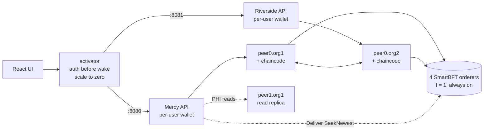
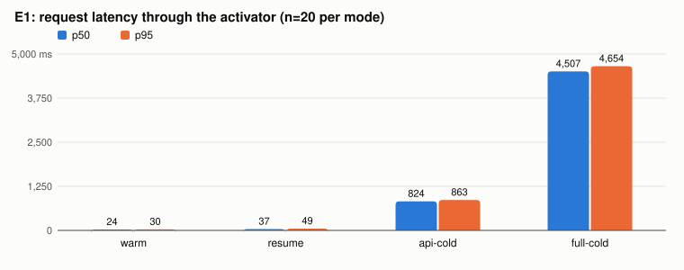
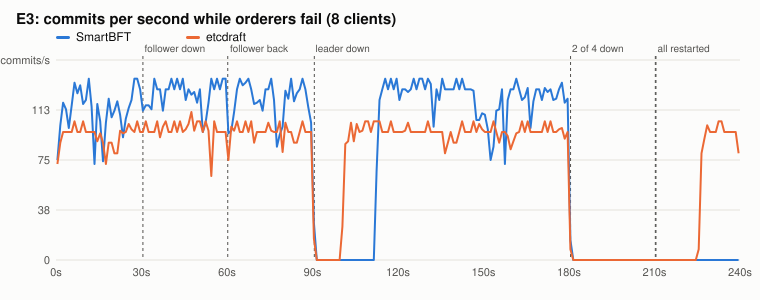
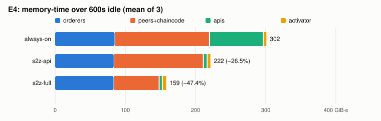
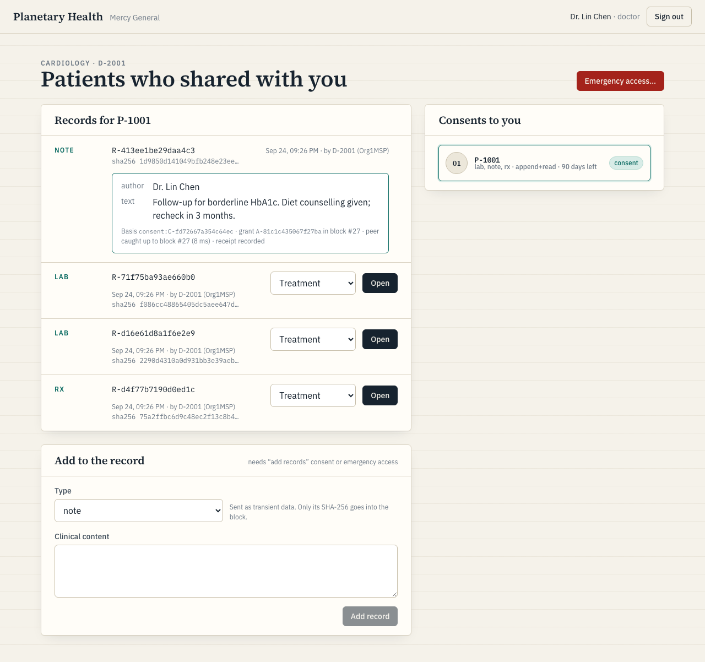
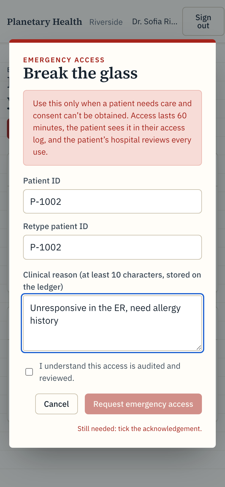
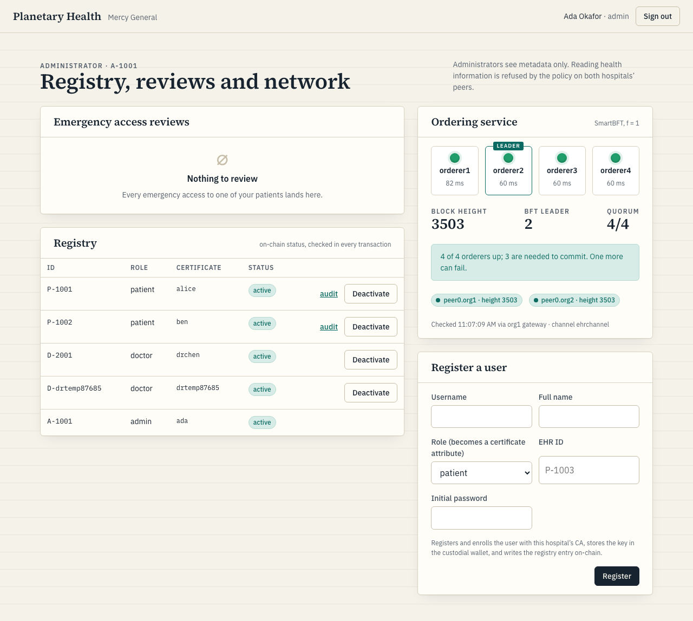

# Planetary Health

This decentralized electronic health record runs on Hyperledger Fabric 3.1.5. Mercy General
(Org1) and Riverside Clinic (Org2) share a channel with four SmartBFT orderers. The network
keeps working if one orderer crashes or lies. Smart-contract access control decides who can read
each record using patient consent scoped by record type and expiry, audited break-glass access
for emergencies, and metadata-only access for administrators. Both hospitals' peers check the
policy again on every write.

A Go "activator" in front of each hospital's API scales the API, and optionally its peers, to
zero when idle. The project tests that serverless-style deployment can cut the cost of a blockchain
EHR. Everything runs locally in Docker; nothing is deployed elsewhere.

## Architecture



| Component | Path | What it does |
|---|---|---|
| Chaincode (Go, contract-api v2.2.1) | `chaincode/ehr` | Registry, records, consent, break-glass, access grants, audit. The pure `Authorize` policy is in `contract/policy.go`. |
| Gateway (TypeScript, fabric-gateway 1.12.1) | `gateway` | Per-org REST API. Signs every proposal as the logged-in user's own certificate. Runs the PHI delivery path. |
| Activator (Go) | `activator` | Scale-to-zero proxy over the Docker Engine API, with endorsement-group wakes. |
| UI (React 19 + Vite) | `ui` | Patient, doctor and admin views, and a network panel. |
| Network scripts | `network` | fabric-samples test network at a pinned commit, the Raft comparison channel, the read replica, CRL revocation. |
| Experiments | `experiments` | E1-E4 harness; writes `experiments/results/*.json` and the tables below. |

## What's on-chain and what isn't

| Where | What |
|---|---|
| Public ledger | Registry entries (ID, org, enrollment ID, active flag), record metadata and SHA-256 digest, consents, break-glass grants, access grants and delivery receipts. No PHI. |
| `PHICollection` (private data, both orgs) | Record contents. They are passed only in the transient map, never in arguments or blocks. |
| Gateway (off-chain) | The custodial wallet (AES-256-GCM, `0600`), password hashes, and the single-use delivery table (SQLite). |

## Who can do what

| | Patient | Doctor | Admin |
|---|---|---|---|
| Read own records | yes | | |
| Read a patient's PHI | | with consent covering the record type, or break-glass | never (metadata only, own org) |
| Add a record | | with "append" consent, or break-glass | |
| Grant / revoke consent | own records | | |
| Break-glass (60 min) | | yes, with a reason, reviewed | reviews their org's patients |
| Register / deactivate users | | | own org only |

Roles come from certificate attributes (`ehr.role`, `ehr.id`) issued by each org's Fabric CA.
The chaincode reads them through `cid`, and no transaction accepts a role or caller argument.
The on-chain registry binds each ID to one enrollment and carries the active flag.

## Quickstart

Requirements: Docker Desktop (arm64 or amd64; about 3 GB of RAM for the network and app tier),
Go 1.24, Node 22.13+, pnpm 10, `jq`.

```bash
make setup          # pnpm install, go mod download, copy .env.example to .env
make test           # chaincode, activator, gateway, UI and harness unit tests; no network needed
make bootstrap      # fabric-samples@119d3bc53f, Fabric 3.1.5 binaries and images, CA 1.5.22
make network-up     # BFT + Raft channels, chaincode, read replica, demo users (~4 min)
make app-build app-up   # activator + UI; both hospital APIs created stopped
open http://localhost:8088
```

Demo accounts: passwords are the username plus `-demo`.

| Hospital | User | Role |
|---|---|---|
| Mercy General | `alice`, `ben` | patients (P-1001, P-1002) |
| Mercy General | `drchen` | doctor (D-2001) |
| Mercy General | `ada` | admin (A-1001) |
| Riverside Clinic | `drrivera` | doctor (D-3001) |
| Riverside Clinic | `omar` | admin (A-3001) |

The first request after an idle period is a cold start. The activator adds `X-Cold-Start` and
`X-Activation-Ms` headers. Tear everything down with `make down`.

Other targets:
- `make gateways-host` then `make e2e` runs the live scenario checks (below).
- `make bft-demo` runs the orderer fault demo and writes [docs/bft-demo.md](docs/bft-demo.md).
- `make exp-coldstart exp-throughput exp-faults exp-idle exp-report` runs the experiments and
  regenerates the results section.

## How reading PHI works

A submit response ends up in a block, while an evaluate does not commit. A PHI read therefore
needs two transactions and gateway-side bookkeeping:

1. **Grant.** `RequestAccess` is submitted and endorsed by both hospitals. The policy runs
   against current consent and break-glass keys, then an `AccessGrant` is written: actor
   certificate, record, basis, 5-minute expiry. If a revocation commits first, the grant fails
   validation (phantom/MVCC read conflict).
2. **Freshness boundary.** The gateway asks the ordering service itself for its newest block: a
   signed Deliver `SeekNewest` to all four orderers, taking the second-largest of the first
   three answers. (The original plan took the max of two answers. That lets a single lying
   orderer inflate the boundary and stall every read, so this deliberately uses n−f answers and
   the (f+1)-th largest; docs/threat-model.md has the trade-off.) It then waits for the read peer to commit through that block, or returns 503
   after 5 s (15 s for the replica gateways in the e2e, see below). It never serves data older
   than that boundary.
3. **Delivery.** `ReadRecordPHI` goes straight to that peer's Endorser. It re-checks the grant
   and the current consent, and hashes the private data against the on-ledger digest. The
   gateway records the `accessId` as consumed (unique key) before returning anything, so replay
   gets 409.
4. **Receipt.** `RecordDelivery` is submitted, retried from an outbox if ordering is down.

What the ledger guarantees and what is trusted to each hospital's gateway is spelled out in
[docs/threat-model.md](docs/threat-model.md), including the bounded race for revocations that
arrive after the boundary.

## Serverless tier

The activator follows the same pattern as Knative's activator and Fly's autostart proxy:

- States: `stopped/paused → waking → ready → idle → stopping`.
- Concurrent requests share one activation.
- Authentication is checked before anything wakes. Login wakes only the API container.

Modes:
- `always_on`: the baseline. It uses the same proxy path, so overhead is identical.
- `api`: each hospital's API container stops after 60 s idle.
- `full`: the peers and their chaincode containers also stop, after 300 s. MAJORITY endorsement
  means every write needs both hospitals' peers, and even a PHI read submits a grant first. So a
  request to either API wakes the whole endorsement group (both peers). Readiness means:
  1. both peers pass `/healthz`;
  2. the gateway reads the orderer boundary and has caught up to it;
  3. a real `Ping` proposal is endorsed by both orgs and thrown away;
  4. every group peer's ledger height has passed the boundary.

The four BFT orderers stay on. Progress needs 3 of 4 live consenters, so a sleeping replica adds
no fault tolerance. When a replica wakes, it must catch up and may need a view change; complaint
and view-change timeouts are 20 s. Only live replicas can complain about a faulty leader. The
orderers are shared consortium infrastructure. The per-hospital savings in the paper's argument
come from the API and peer tier; E4 measures the cost of keeping orderers on.

## Results

`pnpm -C experiments report` generates the numbers below from `experiments/results/*.json`.
Each file contains a run manifest with host, load, swap and compute-lease holder. The runs used
one Apple M1 Pro (16 GB) and Docker Desktop's ~7.7 GB VM while other workloads were active. The
measurements support relative comparisons, not absolute performance claims.

<!-- experiments:start -->
| Experiment | Configuration | Metric | Result |
|---|---|---|---|
| E1 cold start | warm (n=20) | p50 / p95 latency | 24 / 30 ms |
| E1 cold start | resume (n=20) | p50 / p95 latency | 37 / 49 ms |
| E1 cold start | api-cold (n=20) | p50 / p95 latency | 824 / 863 ms |
| E1 cold start | full-cold (n=20) | p50 / p95 latency | 4,507 / 4,654 ms |
| E1 cold start | PHI read after both orgs idle | p50 latency, successes | 4,629 ms, 5/5 |
| E2 throughput | 1 clients, BFT vs Raft | TPS; commit p50 | 17.6 vs 12.1 TPS; 43 vs 68 ms |
| E2 throughput | 8 clients, BFT vs Raft | TPS; commit p50 | 101.0 vs 85.1 TPS; 41 vs 72 ms |
| E2 throughput | 32 clients, BFT vs Raft | TPS; commit p50 | 160.3 vs 239.7 TPS; 103 vs 60 ms |
| E2 throughput | 64 clients, BFT vs Raft | TPS; commit p50 | 146.0 vs 253.2 TPS; 203 vs 108 ms |
| E3 faults | SmartBFT: follower down / leader down / 2 of 4 down / restart | TPS; next commit; commits; recovery | 125.4 TPS; 21.6 s; 0 (quorum error); after restart: 31.1 s |
| E3 faults | etcdraft: follower down / leader down / 2 of 4 down / restart | TPS; next commit; commits; recovery | 97.7 TPS; 7.8 s; 0; after restart: 4.9 s |
| E4 idle cost | always-on, 600s × 3 repeats | CPU-s; GiB·s (saved); per repeat; saved excl. repeat 1 | 39.1; 301.7 (0.0%); 342.2 / 282.0 / 281.0; 0.0% |
| E4 idle cost | s2z-api, 600s × 3 repeats | CPU-s; GiB·s (saved); per repeat; saved excl. repeat 1 | 40.6; 221.9 (26.5%); 251.5 / 207.6 / 206.7; 26.4% |
| E4 idle cost | s2z-full, 600s × 3 repeats | CPU-s; GiB·s (saved); per repeat; saved excl. repeat 1 | 26.5; 158.8 (47.4%); 175.7 / 150.5 / 150.3; 46.6% |
| e2e | live network, host gateways | checks passed | 27/27 |

Run conditions (from the manifests):

| Result file | Recorded | Power | Swap in use | Load avg (1/5/15 min) |
|---|---|---|---|---|
| e2e.json | 2024-09-25T14:52:08.473Z | not recorded | not recorded | not recorded |
| bft-demo.json | 2024-09-25T10:55:25-0400 | AC Power | 10616.12M | 14.41 / 39.54 / 30.45 |
| throughput.json | 2024-09-24T15:37:33-0400 | AC Power | 5802.31M | 13.70 / 9.91 / 9.24 |
| faults.json | 2024-09-25T11:06:27-0400 | AC Power | 11324.25M | 10.04 / 12.94 / 19.30 |
| coldstart.json | 2024-09-24T21:29:54-0400 | Battery Power | 8471.25M | 6.55 / 33.07 / 70.01 |
| idle.json | 2024-09-24T23:04:16-0400 | Battery Power | 10868.00M | 4.99 / 5.17 / 4.02 |







Full tables: [experiments/RESULTS.md](experiments/RESULTS.md).
<!-- experiments:end -->

The runs show:

- **Cold starts (E1).** Resuming a paused API costs little over a warm request. Starting a
  stopped API costs most of a second, dominated by the readiness check (orderer boundary plus a
  real two-org endorsement), not by `docker start`. A full cold start also boots both peers and
  relaunches their chaincode containers, and costs several seconds. The first PHI read after
  both hospitals idle (a grant submit plus a delivery) succeeded in every trial.
- **BFT vs Raft on the same four orderers (E2).** SmartBFT committed more transactions per second
  at 1 and 8 clients. etcdraft pulled ahead at 32 and 64 clients, with lower commit latency. Both
  channels cut blocks at 10 messages; SmartBFT takes `RequestBatchMaxCount` from
  `BatchSize.MaxMessageCount` (`orderer/consensus/smartbft/util.go` in v3.1.5). The levels were
  interleaved, alternating which channel ran first. The BFT advantage at low concurrency comes
  from the batch timers. With one client a Raft block waits out the 50 ms `BatchTimeout` (its
  fastest commit in the run was above that), while SmartBFT proposes as soon as the leader has
  a request. Each level is a single 45 s run on a loaded host, so small differences are noise.
- **Faults (E3).** Both channels kept committing with one follower down. After the leader was
  stopped, both stalled until a new leader took over; Raft recovered faster than SmartBFT. With
  two of four orderers down neither committed. For BFT, every probe sent in that window got the
  gateway's "insufficient number of orderers" quorum error. For Raft the errors were "no
  orderers could process" and commit deadlines. After everything restarted, both channels
  committed again within the 90 s recovery window, Raft sooner. Recovery times come from an
  independent probe that sends a fresh `Ping` every second with an 8 s commit deadline. That
  matters because the closed-loop workers can all sit waiting on commits that never happen.
- **Failover time depends on the conditions.** The [BFT demo](docs/bft-demo.md) runs on an
  idle channel, and its leader failover took longer than E3's, which runs under steady load.
  Our hypothesis, not confirmed by the orderer logs we captured, is that under load a stalled
  leader is noticed through request-forwarding and complaint timeouts, while an idle channel has
  to wait for the leader-heartbeat timeout. In the demo the restarted follower also stayed one
  block behind the others for the whole wait before the leader was stopped (heights are in
  `bft-demo.json`).
- **Idle cost (E4).** Scaling the APIs to zero cut idle memory-time by about a quarter, and scaling
  peers too cut it by almost half. The always-on orderers are a fixed floor in every mode. CPU
  barely moved in api mode (the idle APIs used little CPU to begin with). In s2z-full the peers
  only sleep after 300 s, so for about half of each 600 s window. This supports the paper's
  thesis for memory-time at the API and peer tier. It says nothing about managed-platform prices,
  and Docker Desktop's VM overhead isn't counted.





## Testing

- `chaincode/ehr`: table tests for the pure policy, plus scenario tests on a hand-written fake
  stub. The scenarios cover subject substitution, role escalation, cross-org access,
  deactivation, revoke-after-grant, expired and foreign grants, replay after a receipt,
  integrity tampering, backdated proposals, and missing private data.
- `activator`: the lifecycle state machine with a fake Docker engine. Covered: full cold start
  wakes both peers; a warm Org1 waits for a sleeping Org2; peers must pass the orderer boundary;
  a wake timeout returns 503; one activation for 50 concurrent requests; login wakes only the API;
  idle reaping. Also auth-before-wake, readiness, and the Docker client over a unix socket.
  Run with `-race`.
- `gateway`: JWT and login (tampered, expired, `alg=none`, cross-org tokens); single-use delivery
  (replay, concurrent replay); the freshness wait and the 503 on timeout; the receipt outbox;
  error mapping; the n−f boundary with one lying orderer; wallet encryption.
- `make e2e`: the same contract items against the live network, plus things only a network can
  show. These include a grant ordered after a revocation (409 then 403), a paused read replica
  (403 after catch-up, 503 when kept paused), the `FRESHNESS=off` negative control, and CRL
  revocation. The replica test pauses `peer1.org1`, commits 60 filler transactions and then the
  revocation, so the replica has real work to do after unpausing. Its catch-up is measured and
  stored as `replicaCatchUpMs` in `experiments/results/e2e.json`: under a second (891 ms) in the
  committed run. In earlier local runs whose logs weren't kept it took longer than 5 s, so the
  replica and control gateways use a 15 s freshness timeout. The org gateways keep the 5 s
  default.

CI runs the Go tests, and runs the gateway, UI and harness unit tests a second time inside a
`--network none` container. The Fabric stack itself has no egress-blocked mode: the network,
the e2e and the experiments need Docker plus the images and binaries from `make bootstrap`, so
they run locally (`scripts/lease-run.sh` brings the network up, runs them, and tears it down)
and their result files are committed.

## HIPAA mapping

The full table is in [docs/hipaa-mapping.md](docs/hipaa-mapping.md). In short: unique
per-user certificates, break-glass with review, automatic logoff, TLS, an endorsed audit trail
of every grant, digest-based integrity checks, and scoped consent. The caveats matter as much
as the mapping. This is not compliant or certified. Keys are custodial. Fabric does not encrypt
private data at rest. The demo REST API is plain HTTP. Delivery counts are trusted to each
hospital's gateway. All four orderers are run by one organization on one host.

## Limitations

- One machine and synthetic data only. All four orderers belong to one org, so "Byzantine" here
  means the protocol tolerates it, not that independent parties run it.
- Custodial keys in a file wallet. HS256 JWTs, so the activator holds both orgs' verification
  secrets.
- `docker pause` keeps memory resident, unlike a platform "suspend". Docker Desktop VM overhead
  isn't attributed in E4.
- Nothing is deployed to AWS or Fly. [docs/serverless-deployment.md](docs/serverless-deployment.md)
  is a paper mapping.
- The activator holds the Docker socket, which is root-equivalent on the host.
- If registering a user fails after the CA enrollment, the gateway revokes the new identity.
  Fabric CA keeps revoked registrations, so that username can't be reused.
- Once, a BFT channel that had been idle for about four hours stopped committing (height stuck;
  orderer cluster sends failing with EOF) and a restart of the orderers didn't fix it. A fresh
  network didn't reproduce it, and the cause was not found.
- The replica catch-up time after a pause varied between runs: under a second (891 ms) in the
  committed run, more than 5 s in earlier runs that weren't kept. That is why the e2e's replica
  gateways use a 15 s freshness timeout.
- E1 and E4 ran on battery power with 8–11 GB of swap in use, and E2 with a load average near
  14 (see the run-conditions table). Other agents' workloads shared the machine. Absolute
  latencies and CPU numbers would be lower on an idle host; the comparisons within each run are
  the point.

## Related work

A. Rana, K. Lu, and R. Singh, "Enhancing Electronic Health Record Systems with Serverless
Blockchain Integration," *Proc. IEEE CCCI 2024*, doi:[10.1109/CCCI61916.2024.10736469](https://doi.org/10.1109/CCCI61916.2024.10736469).
The paper argues that the cost and complexity of blockchain EHRs can be cut by serverless
deployment: components scale to zero when idle and pay a cold start when used. This repository
is an independent implementation that tests that thesis on a local Docker testbed. It does not
reproduce the paper's experiments.

Also relevant:
- the Hyperledger Fabric documentation on the [BFT ordering service](https://hyperledger-fabric.readthedocs.io/en/latest/orderer/ordering_service.html)
  and [SmartBFT RFC 006](https://github.com/hyperledger/fabric-rfcs/blob/main/text/006-bft-based-ordering-service.md);
- Knative's activator;
- Fly.io's [autostop/autostart](https://fly.io/docs/launch/autostop-autostart/).

## License

Apache-2.0, matching Hyperledger Fabric. The network scripts drive the fabric-samples test
network (Apache-2.0), which is downloaded at a pinned commit and not vendored.
