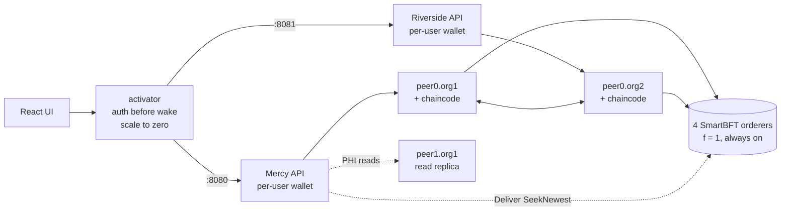

# Planetary Health

A decentralized electronic health record on Hyperledger Fabric 3.1.5. Two hospitals, Mercy
General (Org1) and Riverside Clinic (Org2), share one channel ordered by four SmartBFT orderers,
so one orderer can crash or lie without stopping the network. Smart-contract access control
decides who can read which records: patient consent scoped by record type and expiry, audited
break-glass for emergencies, and metadata-only access for administrators. Both hospitals' peers
re-check that policy on every write.

A Go "activator" in front of each hospital's API scales it, and optionally its peers, to zero
when idle. This tests the thesis of Rana, Lu and Singh (IEEE CCCI 2024, see [Related work](#related-work))
that serverless-style deployment cuts the cost of a blockchain EHR. Everything runs locally on
Docker; nothing is deployed anywhere.

## Architecture



| Component | Path | What it does |
|---|---|---|
| Chaincode (Go, contract-api v2.2.1) | `chaincode/ehr` | Registry, records, consent, break-glass, access grants, audit. The pure `Authorize` policy is in `contract/policy.go`. |
| Gateway (TypeScript, fabric-gateway 1.12.1) | `gateway` | Per-org REST API. Signs every proposal as the logged-in user's own certificate. Runs the PHI delivery path. |
| Activator (Go) | `activator` | Scale-to-zero proxy over the Docker Engine API, with endorsement-group wakes. |
| UI (React 19 + Vite) | `ui` | Patient, doctor and admin views, and a network panel. |
| Network scripts | `network` | fabric-samples test network at a pinned commit, the Raft comparison channel, the read replica, CRL revocation. |
| Experiments | `experiments` | E1–E4 harness; writes `experiments/results/*.json` and the tables below. |

## What's on-chain and what isn't

| Where | What |
|---|---|
| Public ledger | Registry entries (ID, org, enrollment ID, active flag), record metadata and SHA-256 digest, consents, break-glass grants, access grants and delivery receipts. No PHI. |
| `PHICollection` (private data, both orgs) | Record contents. They are passed only in the transient map, never in arguments or blocks. |
| Gateway (off-chain) | The custodial wallet (AES-256-GCM, `0600`), password hashes, and the single-use delivery table (SQLite). |

## Who can do what

| | Patient | Doctor | Admin |
|---|---|---|---|
| Read own records | yes | | |
| Read a patient's PHI | | with consent covering the record type, or break-glass | never (metadata only, own org) |
| Add a record | | with "append" consent, or break-glass | |
| Grant / revoke consent | own records | | |
| Break-glass (60 min) | | yes, with a reason, reviewed | reviews their org's patients |
| Register / deactivate users | | | own org only |

Roles come from certificate attributes (`ehr.role`, `ehr.id`) issued by each org's Fabric CA.
The chaincode reads them through `cid`, and no transaction accepts a role or caller argument.
The on-chain registry binds each ID to one enrollment and carries the active flag.

## Quickstart

Requirements: Docker Desktop (arm64 or amd64; about 3 GB of RAM for the network and app tier),
Go 1.24, Node 22.13+, pnpm 10, `jq`.

```bash
make setup          # pnpm install, go mod download, copy .env.example to .env
make test           # chaincode, activator, gateway, UI and harness unit tests; no network needed
make bootstrap      # fabric-samples@119d3bc53f, Fabric 3.1.5 binaries and images, CA 1.5.22
make network-up     # BFT + Raft channels, chaincode, read replica, demo users (~4 min)
make app-build app-up   # activator + UI; both hospital APIs created stopped
open http://localhost:8088
```

Demo accounts: passwords are the username plus `-demo`.

| Hospital | User | Role |
|---|---|---|
| Mercy General | `alice`, `ben` | patients (P-1001, P-1002) |
| Mercy General | `drchen` | doctor (D-2001) |
| Mercy General | `ada` | admin (A-1001) |
| Riverside Clinic | `drrivera` | doctor (D-3001) |
| Riverside Clinic | `omar` | admin (A-3001) |

The first request after an idle period is a cold start. The activator adds `X-Cold-Start` and
`X-Activation-Ms` headers. Tear everything down with `make down`.

Other targets:
- `make gateways-host` then `make e2e` runs the live scenario checks (below).
- `make bft-demo` runs the orderer fault demo and writes [docs/bft-demo.md](docs/bft-demo.md).
- `make exp-coldstart exp-throughput exp-faults exp-idle exp-report` runs the experiments and
  regenerates the results section.

## How reading PHI works

A submit's response ends up in the block, and an evaluate doesn't commit, so a PHI read can't
be one transaction. It is two, plus gateway-side bookkeeping:

1. **Grant.** `RequestAccess` is submitted and endorsed by both hospitals. The policy runs
   against current consent and break-glass keys, then an `AccessGrant` is written: actor
   certificate, record, basis, 5-minute expiry. If a revocation commits first, the grant fails
   validation (phantom/MVCC read conflict).
2. **Freshness boundary.** The gateway asks the ordering service itself for its newest block: a
   signed Deliver `SeekNewest` to all four orderers, taking the second-largest of the first
   three answers. It then waits for the read peer to commit through that block, or returns 503
   after 5 s (15 s for the replica gateways in the e2e, see below). It never serves data older
   than that boundary.
3. **Delivery.** `ReadRecordPHI` goes straight to that peer's Endorser. It re-checks the grant
   and the current consent, and hashes the private data against the on-ledger digest. The
   gateway records the `accessId` as consumed (unique key) before returning anything, so replay
   gets 409.
4. **Receipt.** `RecordDelivery` is submitted, retried from an outbox if ordering is down.

What the ledger guarantees and what is trusted to each hospital's gateway is spelled out in
[docs/threat-model.md](docs/threat-model.md), including the bounded race for revocations that
arrive after the boundary.

## Serverless tier

The activator follows the same pattern as Knative's activator and Fly's autostart proxy:

- States: `stopped/paused → waking → ready → idle → stopping`.
- Concurrent requests share one activation.
- Authentication is checked before anything wakes. Login wakes only the API container.

Modes:
- `always_on`: the baseline. It uses the same proxy path, so overhead is identical.
- `api`: each hospital's API container stops after 60 s idle.
- `full`: the peers and their chaincode containers also stop, after 300 s. MAJORITY endorsement
  means every write needs both hospitals' peers, and even a PHI read submits a grant first. So a
  request to either API wakes the whole endorsement group (both peers). Readiness means:
  1. both peers pass `/healthz`;
  2. the gateway reads the orderer boundary and has caught up to it;
  3. a real `Ping` proposal is endorsed by both orgs and thrown away;
  4. every group peer's ledger height has passed the boundary.

The four BFT orderers stay always on. Sleeping replicas provide no fault tolerance: progress
needs 3 of 4 live consenters. Waking a replica means catch-up and possibly a view change, with
20 s complaint and view-change timeouts. Only live replicas can complain about a faulty leader.
Orderers are shared consortium infrastructure, so the per-hospital savings the paper argues for
come from the API and peer tier. E4 measures what the always-on orderers cost.

## Results

The E1–E4 experiments have not been run yet, so there are no cost, latency, throughput, or fault
measurements to report. The local EHR scenario run recorded 27 passing checks in
[`experiments/results/e2e.json`](experiments/results/e2e.json); that file records check results,
not an experiment manifest. `pnpm -C experiments report` will populate the tables below after
the experiment result files exist.

<!-- experiments:start -->
Not run yet.
<!-- experiments:end -->

## Testing

- `chaincode/ehr`: table tests for the pure policy, plus scenario tests on a hand-written fake
  stub. The scenarios cover subject substitution, role escalation, cross-org access,
  deactivation, revoke-after-grant, expired and foreign grants, replay after a receipt,
  integrity tampering, backdated proposals, and missing private data.
- `activator`: the lifecycle state machine with a fake Docker engine. Covered: full cold start
  wakes both peers; a warm Org1 waits for a sleeping Org2; peers must pass the orderer boundary;
  a wake timeout returns 503; one activation for 50 concurrent requests; login wakes only the API;
  idle reaping. Also auth-before-wake, readiness, and the Docker client over a unix socket.
  Run with `-race`.
- `gateway`: JWT and login (tampered, expired, `alg=none`, cross-org tokens); single-use delivery
  (replay, concurrent replay); the freshness wait and the 503 on timeout; the receipt outbox;
  error mapping; the n−f boundary with one lying orderer; wallet encryption.
- `make e2e`: the same contract items against the live network, plus things only a network can
  show. These include a grant ordered after a revocation (409 then 403), a paused read replica
  (403 after catch-up, 503 when kept paused), the `FRESHNESS=off` negative control, and CRL
  revocation. The replica test pauses `peer1.org1`, commits 60 filler transactions and then the
  revocation, so the replica has real work to do after unpausing. Its catch-up (measured and
  stored as `replicaCatchUpMs` in `experiments/results/e2e.json`) has taken longer than 5 s in
  some runs, so the replica and control gateways use a 15 s freshness timeout. The org gateways
  keep the 5 s default.

CI runs the unit tests. It doesn't start the Fabric network, so the e2e and experiments are run
locally (`scripts/lease-run.sh` brings the network up, runs them, and tears it down) and their
result files are committed.

## HIPAA mapping

The full table is in [docs/hipaa-mapping.md](docs/hipaa-mapping.md). In short: unique
per-user certificates, break-glass with review, automatic logoff, TLS, an endorsed audit trail
of every grant, digest-based integrity checks, and scoped consent. The caveats matter as much
as the mapping. This is not compliant or certified. Keys are custodial. Fabric does not encrypt
private data at rest. The demo REST API is plain HTTP. Delivery counts are trusted to each
hospital's gateway. All four orderers are run by one organization on one host.

## Limitations

- One machine and synthetic data only. All four orderers belong to one org, so "Byzantine" here
  means the protocol tolerates it, not that independent parties run it.
- Custodial keys in a file wallet. HS256 JWTs, so the activator holds both orgs' verification
  secrets.
- `docker pause` keeps memory resident, unlike a platform "suspend". Docker Desktop VM overhead
  isn't attributed in E4.
- Nothing is deployed to AWS or Fly. [docs/serverless-deployment.md](docs/serverless-deployment.md)
  is a paper mapping.
- The activator holds the Docker socket, which is root-equivalent on the host.

## Related work

A. Rana, K. Lu, and R. Singh, "Enhancing Electronic Health Record Systems with Serverless
Blockchain Integration," *Proc. IEEE CCCI 2024*, doi:[10.1109/CCCI61916.2024.10736469](https://doi.org/10.1109/CCCI61916.2024.10736469).
The paper argues that the cost and complexity of blockchain EHRs can be cut by serverless
deployment: components scale to zero when idle and pay a cold start when used. This repository
is an independent implementation that tests that thesis on a local Docker testbed. It does not
reproduce the paper's experiments.

Also relevant:
- the Hyperledger Fabric documentation on the [BFT ordering service](https://hyperledger-fabric.readthedocs.io/en/latest/orderer/ordering_service.html)
  and [SmartBFT RFC 006](https://github.com/hyperledger/fabric-rfcs/blob/main/text/006-bft-based-ordering-service.md);
- Knative's activator;
- Fly.io's [autostop/autostart](https://fly.io/docs/launch/autostop-autostart/).

## License

Apache-2.0, matching Hyperledger Fabric. The network scripts drive the fabric-samples test
network (Apache-2.0), which is downloaded at a pinned commit and not vendored.
